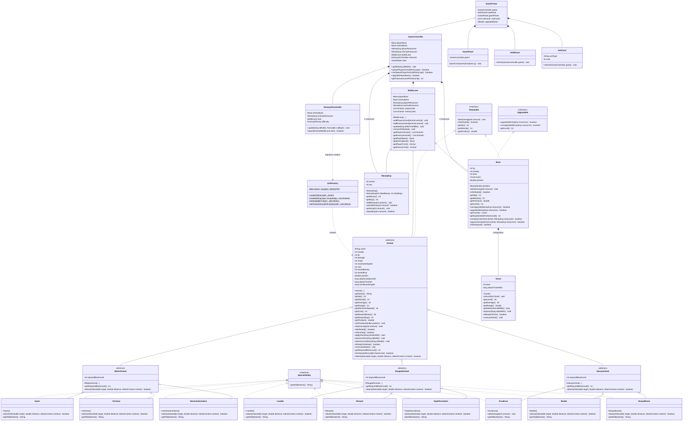

# Diagram Kelas — Animal War (Mermaid)

Diagram relasi kelas lengkap yang menunjukkan Abstraction (Interfaces), Hierarki Inheritance, Polymorphism, dan Komposisi antar komponen.

```mermaid
classDiagram
    %% INTERFACES
    class Attackable {
        <<interface>>
        +takeDamage(int amount)* void
        +isDefeated()* boolean
        +getHp()* int
        +getMaxHp()* int
        +getPosition()* double
    }

    class Upgradable {
        <<interface>>
        +upgrade(MoneyExp resources)* boolean
        +canUpgrade(MoneyExp resources)* boolean
        +getLevel()* int
    }

    class SpecialAbility {
        <<interface>>
        +getAbilityName()* String
    }

    %% ANIMAL BASE ABSTRACT CLASS
    class Animal {
        <<abstract>>
        -String name
        -int maxHp
        -int hp
        -int damage
        -int range
        -int movementSpeed
        -int cost
        -int rewardMoney
        -int rewardExp
        -double position
        -long attackCooldownMs
        -long attackTimerMs
        -long stunRemainingMs
        +Animal(...)
        +getName() String
        +getHp() int
        +getMaxHp() int
        +getDamage() int
        +getRange() int
        +getMovementSpeed() int
        +getCost() int
        +getRewardMoney() int
        +getRewardExp() int
        +getPosition() double
        +setPosition(double position) void
        +takeDamage(int amount) void
        +isDefeated() boolean
        +isStunned() boolean
        +applyStun(long durationMs) void
        +advanceStun(long deltaMs) void
        +advanceCooldown(long deltaMs) void
        +isReadyToAttack() boolean
        +consumeAttack() void
        +getRequiredBaseLevel()* int
        +isUnlockedAtLevel(int baseLevel) boolean
        +attack(Attackable target, double distance, AttackContext context)* boolean
    }
    Attackable <|.. Animal

    %% ABSTRACT ROLES
    class MeleeAnimal {
        <<abstract>>
        -int requiredBaseLevel
        #MeleeAnimal(...)
        +getRequiredBaseLevel() int
        +attack(Attackable target, double distance, AttackContext context) boolean
    }
    class RangedAnimal {
        <<abstract>>
        -int requiredBaseLevel
        #RangedAnimal(...)
        +getRequiredBaseLevel() int
        +attack(Attackable target, double distance, AttackContext context) boolean
    }
    class HeavyAnimal {
        <<abstract>>
        -int requiredBaseLevel
        #HeavyAnimal(...)
        +getRequiredBaseLevel() int
        +attack(Attackable target, double distance, AttackContext context) boolean
    }
    Animal <|-- MeleeAnimal
    Animal <|-- RangedAnimal
    Animal <|-- HeavyAnimal

    %% 9 CONCRETE ANIMALS (POLYMORPHISM PROOF)
    class Ayam {
        +Ayam()
        +attack(Attackable target, double distance, AttackContext context) boolean
        +getAbilityName() String
    }
    class Harimau {
        +Harimau()
        +attack(Attackable target, double distance, AttackContext context) boolean
        +getAbilityName() String
    }
    class HarimauSumatera {
        +HarimauSumatera()
        +attack(Attackable target, double distance, AttackContext context) boolean
        +getAbilityName() String
    }
    MeleeAnimal <|-- Ayam
    MeleeAnimal <|-- Harimau
    MeleeAnimal <|-- HarimauSumatera
    SpecialAbility <|.. Ayam
    SpecialAbility <|.. Harimau
    SpecialAbility <|.. HarimauSumatera

    class Landak {
        +Landak()
        +attack(Attackable target, double distance, AttackContext context) boolean
        +getAbilityName() String
    }
    class Monyet {
        +Monyet()
        +attack(Attackable target, double distance, AttackContext context) boolean
        +getAbilityName() String
    }
    class GajahSumatera {
        +GajahSumatera()
        +attack(Attackable target, double distance, AttackContext context) boolean
        +getAbilityName() String
    }
    RangedAnimal <|-- Landak
    RangedAnimal <|-- Monyet
    RangedAnimal <|-- GajahSumatera
    SpecialAbility <|.. Landak
    SpecialAbility <|.. Monyet
    SpecialAbility <|.. GajahSumatera

    class KuraKura {
        +KuraKura()
        +takeDamage(int amount) void
        +getAbilityName() String
    }
    class Badak {
        +Badak()
        +attack(Attackable target, double distance, AttackContext context) boolean
        +getAbilityName() String
    }
    class BuayaMuara {
        +BuayaMuara()
        +attack(Attackable target, double distance, AttackContext context) boolean
        +getAbilityName() String
    }
    HeavyAnimal <|-- KuraKura
    HeavyAnimal <|-- Badak
    HeavyAnimal <|-- BuayaMuara
    SpecialAbility <|.. KuraKura
    SpecialAbility <|.. Badak
    SpecialAbility <|.. BuayaMuara

    %% BUILDINGS
    class Base {
        -int hp
        -int maxHp
        -int level
        -Turret turret
        -double position
        +Base(double position)
        +takeDamage(int amount) void
        +isDefeated() boolean
        +getHp() int
        +getMaxHp() int
        +getPosition() double
        +getLevel() int
        +canUpgrade(MoneyExp resources) boolean
        +upgrade(MoneyExp resources) boolean
        +getTurret() Turret
        +getExpNeededForNextLevel() int
        +canSpawn(Animal animal, MoneyExp resources) boolean
        +spawnAnimal(Animal animal, MoneyExp resources) boolean
        +isDestroyed() boolean
    }
    Attackable <|.. Base
    Upgradable <|.. Base

    class Turret {
        -int level
        -long attackTimerMillis
        +Turret()
        +setLevel(int level) void
        +getLevel() int
        +getDamage() int
        +getRange() double
        +getAttackIntervalMillis() long
        +advance(long deltaMillis) void
        +isReadyToFire() boolean
        +consumeShot() void
    }
    Base *-- Turret : composition

    %% ECONOMY
    class MoneyExp {
        -int money
        -int exp
        +MoneyExp()
        +MoneyExp(int initialMoney, int initialExp)
        +getMoney() int
        +getExp() int
        +addMoney(int amount) void
        +spendMoney(int amount) boolean
        +gainExp(int amount) void
        +spendExp(int amount) boolean
    }

    %% BATTLE LANE
    class BattleLane {
        -Base playerBase
        -Base enemyBase
        -MoneyExp playerResources
        -MoneyExp enemyResources
        -List~Animal~ playerUnits
        -List~Animal~ enemyUnits
        +BattleLane(...)
        +addPlayerAnimal(Animal animal) void
        +addEnemyAnimal(Animal animal) void
        +update(long deltaTimeMillis) void
        +removeDefeated() void
        +getPlayerAnimals() List~Animal~
        +getEnemyAnimals() List~Animal~
        +getPlayerBase() Base
        +getEnemyBase() Base
        +getPlayerFront() Animal
        +getEnemyFront() Animal
    }
    BattleLane o-- Base
    BattleLane o-- Animal
    BattleLane o-- MoneyExp

    %% FACTORY
    class UnitFactory {
        -Map~String, Supplier~ REGISTRY$
        +create(String type)$ Animal
        +create(String type, int quantity)$ List~Animal~
        +getAvailableTypes()$ Set~String~
        +getTypesForLevel(int baseLevel)$ List~String~
    }
    UnitFactory ..> Animal : creates

    %% CONTROLLER & AI
    class GameController {
        -Base playerBase
        -Base enemyBase
        -MoneyExp playerResources
        -MoneyExp enemyResources
        -BattleLane battleLane
        -EnemyAIController enemyAI
        -GameState state
        +update(long deltaMs) void
        +spawnPlayerAnimal(String type) boolean
        +canSpawnPlayerAnimal(String type) boolean
        +upgradePlayerBase() boolean
        +getPassiveIncomePerSecond() int
    }
    GameController *-- Base : 2 instances
    GameController *-- MoneyExp : 2 instances
    GameController *-- BattleLane
    GameController *-- EnemyAIController

    class EnemyAIController {
        -Base enemyBase
        -MoneyExp enemyResources
        -BattleLane lane
        -EnemyDifficulty difficulty
        +update(long deltaMs, Runnable callback) void
        +spawnEnemy(BattleLane lane) boolean
    }
    EnemyAIController ..> UnitFactory : requests creation

    %% VIEW
    class GameFrame {
        -GameController game
        -HUDPanel hudPanel
        -GamePanel gamePanel
        -List~UnitCard~ unitCards
        -JButton upgradeButton
    }
    class GamePanel {
        -GameController game
        #paintComponent(Graphics g) void
    }
    class HUDPanel {
        +refresh(GameController game) void
    }
    class UnitCard {
        -String unitType
        -int cost
        +refresh(GameController game) void
    }
    GameFrame *-- HUDPanel
    GameFrame *-- GamePanel
    GameFrame *-- UnitCard
    GameFrame o-- GameController
```
